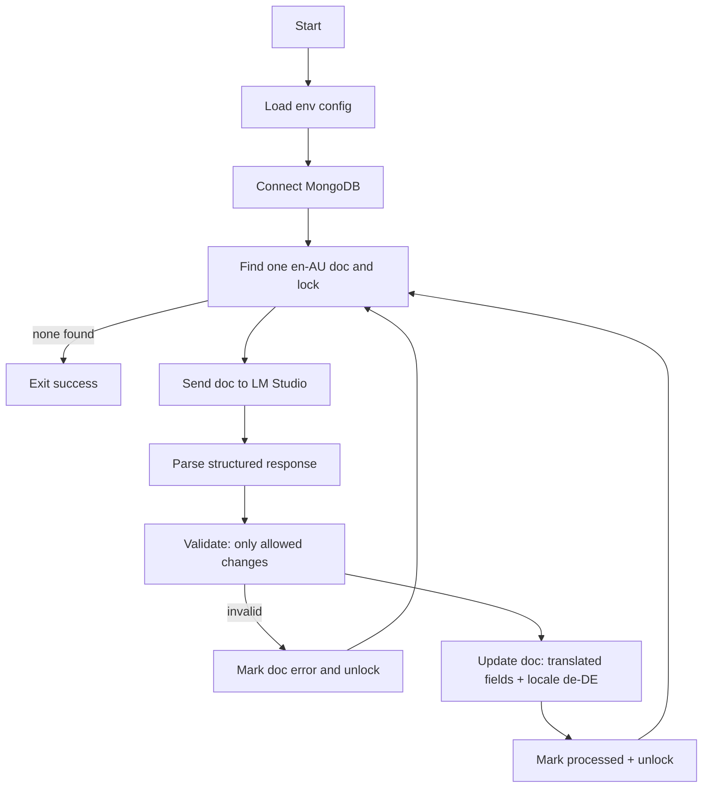

# Plan: Python MongoDB Locale Translator (en-AU ➜ de-DE via LM Studio)

## Goals
- Read documents from a MongoDB collection where `locale == en-AU`.
- Process **one record at a time**.
- For each document, translate **only user-facing text** into German.
- Update the document in MongoDB with translated content and set `locale` to `de-DE`.
- Continue until **no more** documents exist with `locale == en-AU`.
- Use **LM Studio** (OpenAI-compatible local server) to perform translation.

## Non-goals / Constraints
- No schema-specific translation logic in code; the **LLM decides** what is user-facing text.
- The app must still implement guardrails to prevent unsafe or unintended changes.

---

## 1) Configuration (Environment Variables)
All configuration must come from environment variables.

### MongoDB
- `MONGODB_URI` (required) e.g. `mongodb://localhost:27017`
- `MONGODB_DB` (required)
- `MONGODB_COLLECTION` (required)
- `MONGODB_LOCALE_FIELD` (optional, default: `locale`)

### LM Studio (OpenAI-compatible)
- `LMSTUDIO_BASE_URL` (required) e.g. `http://localhost:1234/v1`
- `LMSTUDIO_MODEL` (required) e.g. `qwen2.5-7b-instruct` (whatever is loaded)
- `LMSTUDIO_API_KEY` (optional; default empty) for compatibility with OpenAI clients
- `LMSTUDIO_TIMEOUT_S` (optional; default: `120`)

### Processing + Safety
- `SOURCE_LOCALE` (optional, default: `en-AU`)
- `TARGET_LOCALE` (optional, default: `de-DE`)
- `MAX_DOCS` (optional, default: unlimited) for controlled runs
- `DRY_RUN` (optional, default: `false`) log changes but do not write
- `LLM_MAX_RETRIES` (optional, default: `3`)
- `LLM_TEMPERATURE` (optional, default: `0.2`) reduce creative drift
- `LOCK_FIELD` (optional, default: `_localiserLock`) used to coordinate concurrency
- `PROCESSED_MARK_FIELD` (optional, default: `_localiserProcessedAt`) for idempotency/audit
- `ERROR_FIELD` (optional, default: `_localiserLastError`) store last failure reason

---

## 2) High-level Architecture
Modules:
- `config`: load env vars, validate.
- `db`: Mongo client, atomic find-and-lock, update helpers.
- `llm_client`: OpenAI-compatible chat/completions call to LM Studio.
- `translator`: prompt construction, response parsing, validation, diff.
- `runner`: processing loop, retry policies, logging.

### Data flow


---

## 3) MongoDB Processing Loop (one record at a time)
### Query condition
- `locale_field == SOURCE_LOCALE`.
- Not currently locked: either `LOCK_FIELD` missing OR lock expired.

### Lock strategy (atomic)
Use `find_one_and_update` to atomically claim one document:
- Filter:
  - `locale_field: SOURCE_LOCALE`
  - `LOCK_FIELD` not present OR `LOCK_FIELD.expiresAt < now`
- Update:
  - set `LOCK_FIELD = { owner: <uuid>, lockedAt: now, expiresAt: now+leaseSeconds }`
- Sort: optionally by `_id` ascending for deterministic traversal.

This ensures:
- Only one worker claims a doc at a time.
- Safe crash recovery when locks expire.

### Stop condition
If `find_one_and_update` returns `null`, there are no more `en-AU` documents to process (or all are locked). If all are locked, loop can sleep briefly and retry; but requirement says stop when none exist with `en-AU`. To satisfy that strictly:
- Option A (strict): before exit, run a `count_documents({locale_field: SOURCE_LOCALE})`; if > 0 but all locked, wait/retry.
- Option B (single-process expected): exit when claim returns `null`.

Plan assumes **single process** by default, but supports multiple workers safely.

---

## 4) Translation Contract (Prompt + Structured Output)
Because the schema is unknown and the LLM must identify user-facing text, we must require a **structured output** and enforce validation.

### Input to LLM
Send:
- System message: rules (translate user-facing text only; never modify IDs/metadata; preserve structure).
- User message: the full JSON document, plus locale instructions.

### Output schema
Require the model to output **JSON only** with:
- `translated_document`: full document JSON with only user-facing strings translated
- `changed_paths`: array of JSON pointer-like paths the model changed
- `notes`: optional

Example shape:
```json
{
  "translated_document": {"...": "..."},
  "changed_paths": ["/title", "/body/0/text"],
  "notes": "..."
}
```

### Prompt rules (core)
- Translate only content intended for end users: titles, descriptions, UI labels, customer-visible messages.
- Do **not** change:
  - keys/field names
  - numeric values
  - booleans
  - IDs, hashes, slugs, URLs, emails (unless explicitly user-facing free text)
  - timestamps
  - internal codes or configuration
- Preserve whitespace/markup:
  - Keep HTML tags/Markdown formatting; translate only visible text.
- Preserve placeholders:
  - e.g. `{name}`, `${amount}`, `{{var}}`, `%s`, `%d` must remain unchanged.
- Return JSON only.

---

## 5) Validation + Diff Guardrails
Even with LLM autonomy, the app must reject unsafe outputs.

### Validation steps
1. **JSON parse**: response must be valid JSON object.
2. **Structure preservation**:
   - `translated_document` must contain all top-level keys present in original.
   - No new unexpected top-level keys except the locale field and internal audit fields if configured.
3. **Type stability**:
   - For every path in the document tree, the value type must match original (string stays string, object stays object, array stays array).
4. **Change restriction**:
   - Only string values may differ, plus the locale field (`SOURCE_LOCALE` ➜ `TARGET_LOCALE`) and internal audit/lock fields managed by the app.
   - Any change to non-string values is a hard failure.
5. **Locale update enforcement**:
   - The app (not the LLM) sets locale field to `TARGET_LOCALE` at write time.
6. **Optional heuristics** (configurable):
   - If `changed_paths` includes suspicious fields (e.g., `/password`, `/token`), reject.

### Diff mechanism
Implement a recursive diff that returns changed paths and validates type stability.
- Compute `changed_paths_actual` from original vs translated.
- Compare to `changed_paths` from LLM for debugging (do not require exact match).

---

## 6) Idempotency + Safe Retries
### Idempotency
- Only pick docs where `locale_field == SOURCE_LOCALE`.
- After successful update, set `locale_field = TARGET_LOCALE` and `PROCESSED_MARK_FIELD = now`.
- That makes the operation naturally idempotent.

### Retries
- On transient LLM failures (timeout, 5xx), retry up to `LLM_MAX_RETRIES`.
- On invalid LLM output (fails validation), do **not** retry by default; mark doc with `ERROR_FIELD` and unlock. (Optionally allow 1 retry with a stricter prompt.)

---

## 7) MongoDB Update Strategy
Use optimistic safety in the update:
- Update filter includes `_id` and lock ownership (`LOCK_FIELD.owner == owner_uuid`).
- Update sets:
  - translated fields (full document replace or `$set` per path)
  - locale field to `TARGET_LOCALE`
  - `PROCESSED_MARK_FIELD` to now
  - unset lock

### Replace vs patch
- **Patch ($set)** is safer: only update paths that changed (strings) + locale.
- But LLM returns full document; compute patch by diffing and building `$set` updates for changed string paths.

---

## 8) CLI Interface
Command: `python -m localiser`

Options (all optional, env var overrides preferred):
- `--max-docs N`
- `--dry-run`
- `--log-level INFO|DEBUG`

Behavior:
- Logs each processed `_id`, changed paths count, and whether write occurred.
- Exit code non-zero only on startup misconfig or unrecoverable DB failure.

---

## 9) Logging + Observability
- Structured logs (JSON lines) recommended.
- Per document:
  - `_id`
  - lock owner
  - lm studio request id (if available)
  - number of changed paths
  - validation result
  - error reason

---

## 10) Tests Strategy
- Unit tests:
  - diff/type-stability validator
  - patch builder for `$set` updates
  - prompt builder
- Integration tests (optional):
  - local Mongo container or local instance
  - mock LM Studio using a lightweight HTTP server returning canned JSON

---

## 11) Implementation Steps (what Code mode should build)
1. Create Python package `localiser/` with modules: `config.py`, `db.py`, `llm_client.py`, `translator.py`, `validate.py`, `__main__.py`.
2. Add `pyproject.toml` with dependencies:
   - `pymongo`
   - `httpx`
   - `pydantic` (optional for config)
3. Implement DB claim+lock function.
4. Implement LM Studio chat call using OpenAI-compatible endpoint.
5. Implement translate+validate+patch pipeline.
6. Implement runner loop and CLI.
7. Add tests under `tests/`.

---

## Open Decisions (confirm in Code mode via env defaults)
- Default `MONGODB_LOCALE_FIELD` name: `locale`.
- Lock lease seconds default (e.g., 300s).
- Whether to exit when no claimable doc exists vs wait for lock expiry.
